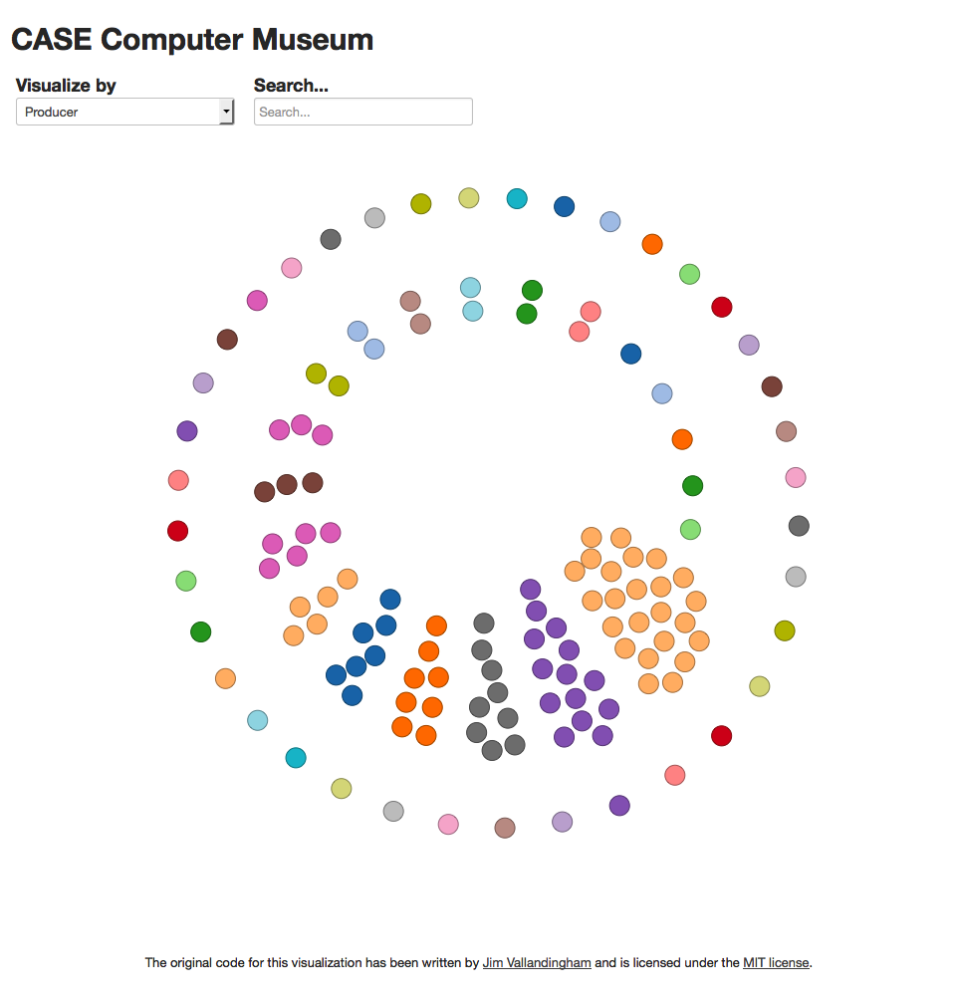

[](http://quantlet.de/)

## [](http://quantlet.de/) **CMBbubbles** [](http://quantlet.de/)

```yaml


Name of QuantLet : CMBbubbles

Published in : Computing Machines

Description : 'Visualizes a collection of computers clustered by various means
using D3.js and CoffeeScript. On hovering brief information of the specific
computer appears (including producer, model name and picture). A live example
can be found at cm.wiwi.hu-berlin.de/viz. Extended upon original work by Jim
Vallandingham.'

Keywords : 'data, web, html, interactive, data visualization, graphical representation, visualization, plot, clustering'

See also : 'CMBbubblesbuilder, CMBcpuscrap, CMBcpureg, CMBcpuregp, CMBhddscrap, CMBhddreg, CMBhddregp'

Author : Torsten van den Berg, Sophie Burgard

Submitted : Wed, May 25 2016 by Torsten van den Berg

Datafile : producer.json, cat.json

```



### PYTHON Code
```python

#!/usr/bin/env python
# -*- coding: utf-8 -*-

# CMBbubbles.py:
# A simple wrapper for CMBbubbles.html for Quantnet compatibility.


# Set HTML header (utf-8)
html_header = 'Content-Type: text/html; charset=utf-8\n\n'

# Open actual HTML
html_content = open('CMBbubbles.html', 'r')

# Output header and actual HTML content
print(html_header)
print(html_content.read())

```

automatically created on 2018-05-28