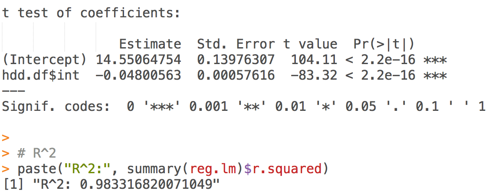

[](http://quantlet.de/index.php?p=info)

## [](http://quantlet.de/) **CMBhddreg** [](http://quantlet.de/d3/ia)

```yaml

Name of QuantLet : CMBhddreg

Published in : Computing Machines

Description : 'Calculates parameters of log-linear regression between log(HDD price per gigabyte)
and time. HC3 standard errors are used. The R^2 value is also provided. Furthermore, the data set
is enriched by adding months as new variable.'

Keywords : 'regression, R-squared, testing, data adjustment, empirical, estimation,
heteroskedasticity, logarithmic, lognormal, model, parameter, preprocessing, test, time-series'

See also : MVAregbank, SFEtail, MVAbankrupt, BCS_Linreg, SFElognormal

Author : Torsten van den Berg, Sophie Burgard

Submitted : Wed, May 25 2016 by Torsten van den Berg

Datafile : hdd.csv

```




### R Code:
```r
# clear variables and close windows
rm(list = ls(all = TRUE))
graphics.off()

# set working directory
#setwd("")
options(stringsAsFactors = FALSE)

# install and load packages
packages = c("sandwich", "lmtest", "zoo")
invisible(lapply(packages, function(pkg) {
    if (!is.element(pkg, installed.packages())) install.packages(pkg)
    library(pkg, character.only = TRUE)
}))

# read data
hdd.df = read.csv2("hdd.csv")

# date formatting 
# (day mostly missing, not important for further analysis, therefore dropped)
hdd.df$date = as.Date(as.yearmon(hdd.df$date, "%Y %B"))

# create month vector
months     = seq(min(hdd.df$date), max(hdd.df$date), "months")
months.int = seq(1, length(months))
month.df   = data.frame(date = months, int = months.int)

# merge dfs
hdd.df = merge(hdd.df, month.df, by = "date")

# regression
reg.lm  = lm(log(hdd.df$per.GB) ~ hdd.df$int)

# coefficients
print(coeftest(reg.lm, vcov. = vcovHC))

# R^2
paste("R^2:", summary(reg.lm)$r.squared)

```
